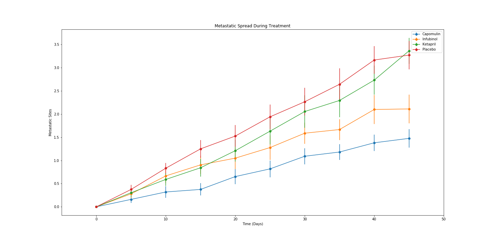
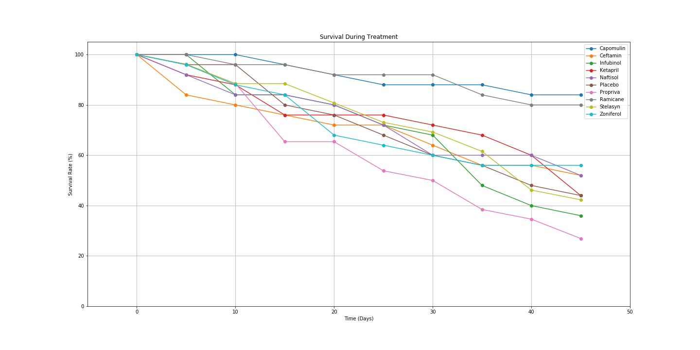

# Pymaceuticals Observations

## Observation 1: Tumor Response
Over the course of the study most drugs did not stop tumors from increasing in size.  Only Capomulin caused a decrease in tumor volume.  Compared to the Placebo treatment, which had roughly a 50% increase in tumor size, only Ketapril had a greater tumor growth over the study.  The rest of the drugs caused at least a lesser amount of growth with Capomulin even causing a decrease in tumor size.

## Observation 2: Tumor Spread
All drugs had some amount of metastatic spread during the treatment period.  Some of the better performing drugs like Capomulin had only one new site on average while others like Ketapril had above three.  It is important to note that only Ketapril had more new sites on average than the placebo.

## Observation 3: Survival
While no drug had a 100% survival rate some had better survival rates than others.  Capomulin had decent survival rate with just above 80% of the starting mice surviving.  On the other end both Infubinol had a survival rate of less than 40% surviving. 

